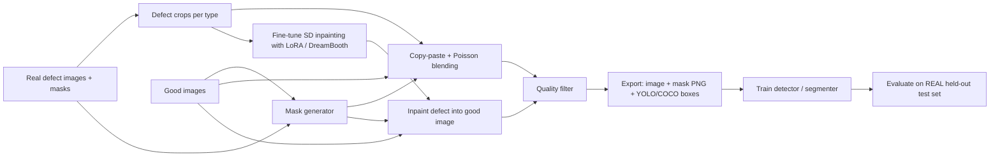

# Artificial Defect Image Generation — Research

**Goal:** start from a few real **defect** images (and many **good** images) and generate many realistic synthetic defect images, with labels, for training CV models:

- **Object detection** (bounding boxes, e.g. YOLO / COCO format)
- **Segmentation** (pixel masks)
- **Anomaly detection with PatchCore** (good images only for training, defect images for validation)

---

## 1. Approach families

| # | Approach | What you need | Realism | Labels for free? | Effort / compute |
|---|---|---|---|---|---|
| 1 | Classical augmentation | Defect images (+ masks) | Real pixels, limited new variety | Yes, masks/boxes are transformed with the image | Very low, CPU |
| 2 | Copy-paste + blending | Defect crops + masks, good images | Medium | Yes, you know where you pasted | Low, CPU |
| 3 | Procedural synthetic anomalies | Good images only | Low–medium (generic, not your real defect look) | Yes | Low, CPU |
| 4 | GANs | Hundreds+ of images; few-shot variants exist | Medium–high | Some methods (e.g. DFMGAN) | High, training can be unstable |
| 5 | Diffusion models (fine-tune + inpaint) | ~5–50 defect images per type + good images, GPU | **High** (current state of the art) | Yes, if you inpaint inside a mask you choose | Medium, GPU |

### 1.1 Classical augmentation
Flip, rotate, crop, scale, brightness/contrast, blur, noise, elastic transform. Library: **Albumentations** (applies the same transform to image, mask and boxes).
- Always do this, whatever else you do.
- Doesn't create new defect shapes, only variations of existing ones.
- Be careful with transforms that change meaning (e.g. color shift when color is the defect).

### 1.2 Copy-paste + blending (recommended baseline)
Cut real defect patches using their masks, apply random transforms, paste them onto good images.
- **Poisson blending** (Pérez et al., SIGGRAPH 2003) via OpenCV `cv2.seamlessClone` makes the paste blend into the background lighting/texture.
- "Simple Copy-Paste" (Ghiasi et al., CVPR 2021) showed copy-paste is a strong augmentation for instance segmentation.
- Paste only at **plausible locations** (on the part, not on the background; use a foreground/ROI mask of the good image).
- Pros: fast, CPU only, defect appearance is real. Cons: limited to the defect shapes you already have; seams possible on textured surfaces.

### 1.3 Procedural synthetic anomalies
Generate fake defects from scratch, used mostly by unsupervised anomaly-detection methods:
- **CutPaste** (Li et al., CVPR 2021): cut a patch of the *same* good image and paste it elsewhere.
- **DRAEM** (Zavrtanik et al., ICCV 2021): Perlin-noise shaped mask filled with an external texture (DTD texture dataset).
- **NSA – Natural Synthetic Anomalies** (Schlüter et al., ECCV 2022): Poisson-blended patches from other good images.
- **MemSeg** (Yang et al., 2022): similar synthetic-anomaly idea for surface defects.
- Useful when you have **no** defect images, but the result usually does not look like your real defects, so it's weaker for supervised detection/segmentation training.

### 1.4 GANs
- **StyleGAN2-ADA** (Karras et al., NeurIPS 2020): GAN training with limited data (adaptive augmentation).
- **CycleGAN** (Zhu et al., ICCV 2017): unpaired translation good ↔ defect. No precise mask unless you add extra steps.
- **DFMGAN** (Duan et al., AAAI 2023, "Few-Shot Defect Image Generation via Defect-Aware Feature Manipulation"): StyleGAN pre-trained on good images, then a defect branch learned from a few defect samples; outputs defect image + defect mask. Evaluated on MVTec AD.
- Generally harder to train and tune than the diffusion approach below; now mostly superseded by diffusion for this task.

### 1.5 Diffusion models (recommended main approach)
Fine-tune a pre-trained text-to-image diffusion model on a few defect samples, then **inpaint** the defect into good images inside a mask you control.

Building blocks:
- **Stable Diffusion inpainting** models (e.g. `stable-diffusion-v1-5/stable-diffusion-inpainting`, `diffusers/stable-diffusion-xl-1.0-inpainting-0.1` on Hugging Face).
- Few-shot personalization to teach the model "your" defect:
  - **DreamBooth** (Ruiz et al., CVPR 2023)
  - **LoRA** (Hu et al., 2021) — small adapter weights, cheap to train, can be combined with DreamBooth
  - **Textual Inversion** (Gal et al., ICLR 2023) — learns only a new token embedding
- **ControlNet** (Zhang et al., ICCV 2023) — optional extra conditioning (edges, masks) for more control over shape.
- **AnomalyDiffusion** (Hu et al., AAAI 2024, "Few-Shot Anomaly Image Generation with Diffusion Model"): purpose-built for this problem; learns defect appearance and defect location/mask from few samples, generates aligned image + mask pairs, and reports improved downstream anomaly detection/classification on MVTec AD. Good to read even if you build your own pipeline.

Tooling: Hugging Face **`diffusers`** (pipelines + DreamBooth/LoRA training example scripts), **`peft`** for LoRA, **`accelerate`**.

---

## 2. Recommended pipeline

Key idea: **put the defect onto a good image inside a known mask** (approaches 2 and 5). The mask you paste/inpaint into becomes the ground-truth label automatically — no manual annotation.



### Stage 1 — Baseline: copy-paste + Poisson blending
1. Extract defect patches from real defect images using their masks.
2. Random scale / rotation / flip / brightness on each patch.
3. Pick a random location inside the part's ROI on a good image.
4. Blend with `cv2.seamlessClone` (try `NORMAL_CLONE` and `MIXED_CLONE`).
5. Save image + pasted mask + box.

Gives you a working dataset in a day and a baseline to compare the diffusion results against.

### Stage 2 — Main: diffusion inpainting
1. **Prepare training crops**: for each defect type, crop ~512×512 regions around real defects (defects are often small; training/generating at full image size downscaled would make them disappear).
2. **Fine-tune** SD inpainting with DreamBooth + LoRA, one LoRA (or one rare token) per defect type, e.g. prompt `"a photo of sks scratch on metal surface"`.
3. **Generate masks** for new defects:
   - reuse real defect mask shapes with random deform / scale / rotate, or
   - random strokes / blobs / Perlin noise shapes that match the defect type (thin lines for scratches, blobs for stains, etc.).
4. **Inpaint**: crop a 512×512 patch from a good image at a plausible location, inpaint inside the mask with the fine-tuned model, paste the patch back into the full-resolution image.
5. **Refine the mask** (important): the model doesn't always fill the whole mask. Compute `|generated − original|` inside the mask, threshold it, and use that as the final label. Discard samples where almost nothing changed.
6. Tune `strength`, guidance scale, number of steps, and mask dilation/feathering to keep the background unchanged and avoid seams.

### Stage 3 — Quality filter
- Drop samples whose defect region is nearly unchanged (from step 5 above).
- Score realism with a classifier trained on **real** data only, or by feature similarity (e.g. CLIP / DINO embeddings) to real defect crops; drop outliers.
- Manually spot-check a random sample of every batch — cheap and catches systematic failures.

### Stage 4 — Export labels (one generation run → all label types)
- **Segmentation**: binary/indexed mask PNG per image.
- **Detection**: mask → connected components (`cv2.connectedComponentsWithStats`) → one box per component → YOLO txt and/or COCO JSON (`pycocotools`).
- **PatchCore**: see section 3.

---

## 3. PatchCore specifics

**PatchCore** (Roth et al., CVPR 2022, "Towards Total Recall in Industrial Anomaly Detection") builds a memory bank of patch features from **good images only**. So:

- **Synthetic defects are not used to train PatchCore.** Training set = real good images only.
- Use synthetic defects (with their free masks) to **validate** PatchCore and **tune the anomaly threshold** (image AUROC, pixel AUROC, PRO), especially when real defect samples are too few for a reliable validation set.
- Always confirm the chosen threshold on **real** defects; a threshold tuned only on synthetic defects can be off.
- Augmentation of good images for PatchCore should be **mild** (small shifts, slight brightness). Avoid transforms that create artifacts (heavy blur, noise, elastic) — they pollute the "normal" memory bank and raise false negatives.
- Never put an image derived from a defect image (or a not-fully-clean good image) into the PatchCore training set.
- Library: **Anomalib** (`openvinotoolkit/anomalib`) has PatchCore (and DRAEM) implementations and MVTec-style dataset loaders.

---

## 4. Evaluation — how to know it actually helps

The only metric that really matters: **does the downstream model get better on real data?**

1. Hold out a **real-only test set**. Never put synthetic images in it.
2. **Avoid leakage**: if a synthetic image was made from defect image X (or uses X's mask shape), X must not be in the test set. Split by source image first, then generate from the training split only.
3. Train the same model with the same settings on:
   - (a) real only
   - (b) real + copy-paste synthetic
   - (c) real + diffusion synthetic
   - (d) real + both
4. Compare on the real test set: mAP@0.5 / mAP@0.5:0.95 (detection), IoU / Dice (segmentation), recall at a fixed false-positive rate (inspection usually cares most about missed defects).
5. Tune the synthetic-to-real ratio empirically; too much synthetic data can make the model learn synthetic artifacts.

Supplementary metrics (realism/diversity, not a replacement for step 4):
- **FID / KID** between real and synthetic defect crops (KID is better with small sample counts).
- **LPIPS** diversity among synthetic samples (detects mode collapse / near copies).

---

## 5. Compute notes (≥12 GB VRAM)
- SD 1.5 inpainting + LoRA at 512×512 with **fp16 mixed precision**, **gradient checkpointing**, and batch size 1–2 (with gradient accumulation) should fit in 12 GB. Using 8-bit Adam (`bitsandbytes`) saves more memory.
- SDXL inpainting LoRA training at 1024×1024 is heavier; on a 12 GB card it may need aggressive memory saving or may not fit — start with SD 1.5.
- Inference (generation) is much lighter than training; a few seconds per image on a typical modern GPU.

---

## 6. Public datasets to prototype with
- **MVTec AD** (Bergmann et al., CVPR 2019) — 15 industrial categories, pixel masks; standard benchmark for DRAEM / PatchCore / DFMGAN / AnomalyDiffusion.
- **VisA** (Zou et al., ECCV 2022) — 12 categories, pixel masks.
- **Kolektor Surface-Defect Dataset (KolektorSDD / KSDD2)** — commutator / surface defects.
- **NEU surface defect database** — hot-rolled steel, 6 defect classes (classification + boxes in NEU-DET).

Prototyping on MVTec AD first lets you compare your results against published numbers before switching to your own data.

---

## 7. Caveats
- Synthetic data **supplements** real data; it rarely replaces it. Biggest wins are usually for **rare defect classes** and **unusual positions/backgrounds**.
- Generated defects can look realistic to humans but still differ statistically; that's why the real-only test set is mandatory.
- Diffusion inpainting masks are approximate → some label noise; mask refinement (Stage 2, step 5) reduces it.
- How much it helps depends heavily on the product, material, and defect types — it can't be predicted without running the Section 4 experiment on your data.
- Check the license of any pre-trained model (e.g. Stable Diffusion's license) before using it commercially.

---

## 8. Proposed code structure (for a future implementation)
```
configs/                        # yaml per product / defect type
data/{good,defect,masks}/
src/augment.py                  # classical augmentation (Albumentations)
src/copy_paste.py               # copy-paste + cv2.seamlessClone
src/mask_gen.py                 # real-shape / random / Perlin masks
src/diffusion/train_lora.py     # DreamBooth + LoRA fine-tune of SD inpainting (diffusers)
src/diffusion/inpaint_generate.py
src/filter.py                   # quality filtering
src/export.py                   # mask PNG / YOLO / COCO export
scripts/eval_downstream.py      # real-only vs real+synthetic comparison
```

---

## 9. References
- Pérez, Gangnet, Blake. *Poisson Image Editing.* SIGGRAPH 2003.
- Zhu et al. *Unpaired Image-to-Image Translation using Cycle-Consistent Adversarial Networks (CycleGAN).* ICCV 2017.
- Bergmann et al. *MVTec AD — A Comprehensive Real-World Dataset for Unsupervised Anomaly Detection.* CVPR 2019.
- Karras et al. *Training Generative Adversarial Networks with Limited Data (StyleGAN2-ADA).* NeurIPS 2020.
- Li et al. *CutPaste: Self-Supervised Learning for Anomaly Detection and Localization.* CVPR 2021.
- Ghiasi et al. *Simple Copy-Paste is a Strong Data Augmentation Method for Instance Segmentation.* CVPR 2021.
- Zavrtanik, Kristan, Skočaj. *DRAEM — A Discriminatively Trained Reconstruction Embedding for Surface Anomaly Detection.* ICCV 2021.
- Hu et al. *LoRA: Low-Rank Adaptation of Large Language Models.* 2021 (ICLR 2022).
- Roth et al. *Towards Total Recall in Industrial Anomaly Detection (PatchCore).* CVPR 2022.
- Schlüter et al. *Natural Synthetic Anomalies for Self-Supervised Anomaly Detection and Localization (NSA).* ECCV 2022.
- Zou et al. *SPot-the-Difference Self-Supervised Pre-training for Anomaly Detection and Segmentation (VisA dataset).* ECCV 2022.
- Gal et al. *An Image is Worth One Word: Personalizing Text-to-Image Generation using Textual Inversion.* ICLR 2023.
- Ruiz et al. *DreamBooth: Fine Tuning Text-to-Image Diffusion Models for Subject-Driven Generation.* CVPR 2023.
- Zhang, Rao, Agrawala. *Adding Conditional Control to Text-to-Image Diffusion Models (ControlNet).* ICCV 2023.
- Duan et al. *Few-Shot Defect Image Generation via Defect-Aware Feature Manipulation (DFMGAN).* AAAI 2023.
- Hu et al. *AnomalyDiffusion: Few-Shot Anomaly Image Generation with Diffusion Model.* AAAI 2024.

Tools: [Albumentations](https://albumentations.ai/), [OpenCV](https://opencv.org/), [Hugging Face diffusers](https://github.com/huggingface/diffusers), [PEFT](https://github.com/huggingface/peft), [Anomalib](https://github.com/openvinotoolkit/anomalib), [pycocotools](https://github.com/cocodataset/cocoapi).
